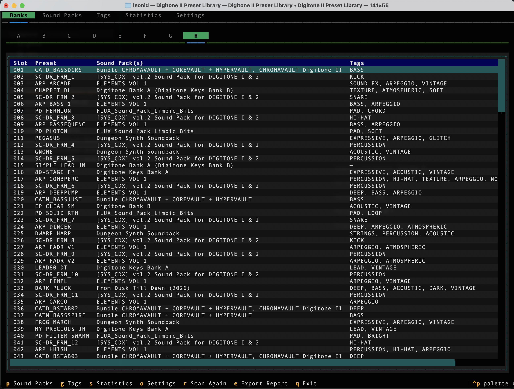
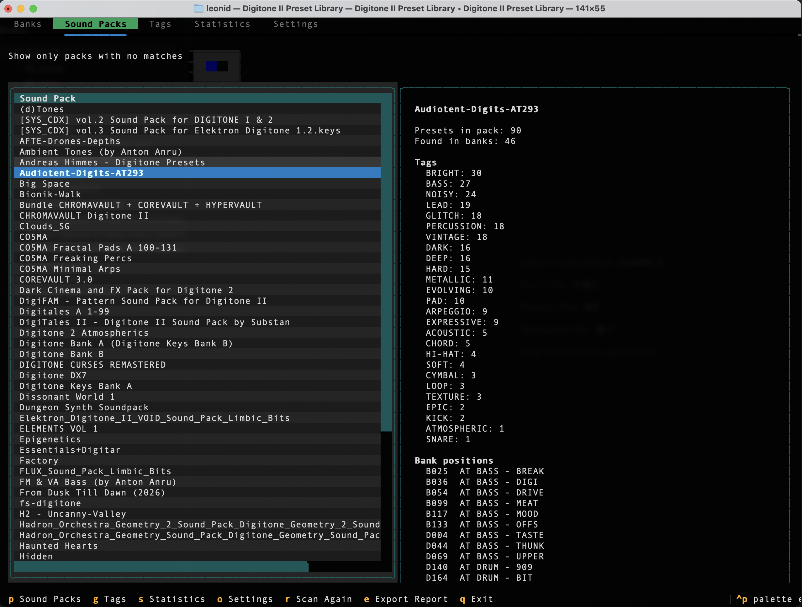
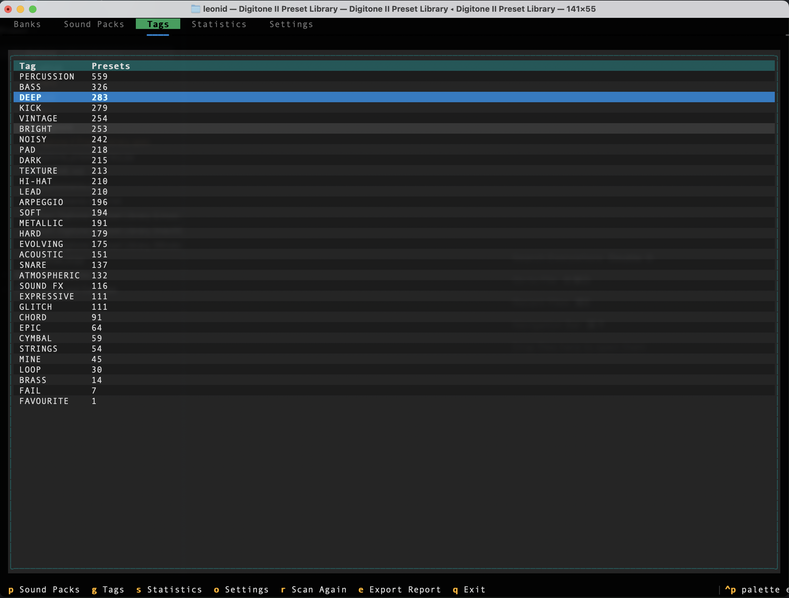
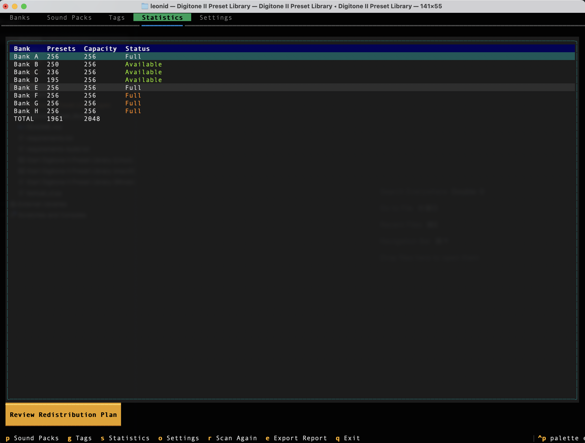
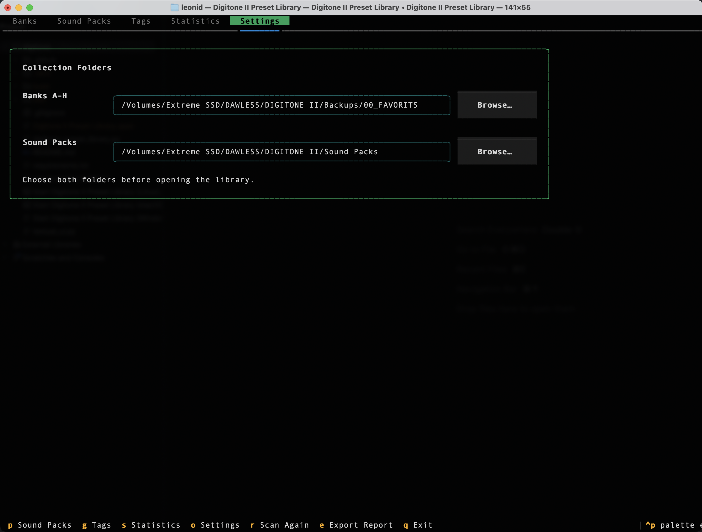

# Digitone II Preset Library

A cross-platform terminal app for browsing a collection of Digitone II presets
organized into banks A–H. It helps you find duplicate presets, browse tags, and
see which sound packs your presets came from. The app works with exported preset
files and does not connect to the Digitone II hardware.

## Download

Standalone builds are available from the repository's **Releases** page:

- Windows x64: `.exe`
- macOS Apple Silicon: `.tar.gz`
- macOS Intel: `.tar.gz`
- Linux x86_64: `.tar.gz`

These builds include Python and all required packages. Users do not need to
install Python or Textual.

## Start the app

If you downloaded a standalone release, extract it if necessary and run the
`Digitone II Preset Library` application. No Python installation is required.

## First launch

The app asks you to select two folders before scanning:

1. **Banks A–H** — the folder that will contain your `A`, `B`, `C`, … `H` bank folders.
2. **Sound packs** — the folder that contains your sound-pack collection.

If any bank folders are missing, the app creates them automatically. It then
shows instructions for using the official **Elektron Transfer** application to
export presets from each Digitone II bank into the corresponding A–H folder.
Existing folders and files are never replaced.

Both selections are saved automatically. You can change them later from
**Settings**. If a saved folder is no longer available, the app opens Settings
and asks you to select a valid folder before continuing.

## Navigation

The main navigation bar is always shown at the top of the screen:

`BANKS` · `SOUND PACKS` · `TAGS` · `STATISTICS` · `SETTINGS`

- Click a tab with the mouse; or
- Press `Tab` to focus the navigation bar and select a tab with the arrow keys.

Tables support mouse selection, arrow-key navigation, and scrolling. Available
keyboard commands are shown in the footer at the bottom of the screen.

Keyboard shortcuts are also available:

- `P` — Sound Packs
- `G` — Tags
- `S` — Statistics
- `O` — Settings
- `E` — export a text report
- `R` — scan the folders again
- `Q` — exit

Within lists, use `↑` and `↓` to move, and `Page Up` / `Page Down` to scroll.

## What you can view

### Banks

Switch directly between banks using the permanent horizontal `A`–`H` tabs.
Browse every preset, see its tags and source sound pack, and spot duplicates
highlighted in red.

### Sound Packs

See which sound packs are represented in your banks. Select a sound pack to
view its tags and matching bank positions. Use the switch above the list to
show only sound packs with no matches.

### Tags

View all tags found in your preset collection and the number of presets using
each tag.

### Statistics

View bank capacity at a glance. Each bank can contain up to 256 presets. If a
bank exceeds that limit, select **Review Redistribution Plan**. Files are not
moved until you explicitly confirm the plan.

### Settings

Change the Banks A–H folder or Sound Packs folder with the **Browse…** buttons.
The new path is saved automatically and the collection is scanned again.

## Running from source

Python 3.10 or newer is required only when running directly from the source
code. Use the launcher for your operating system; it creates a private
environment and installs the required packages automatically:

- **macOS:** `Start Digitone II Preset Library (macOS).command`
- **Linux:** `Start Digitone II Preset Library (Linux).sh`
- **Windows:** `Start Digitone II Preset Library (Windows).bat`
